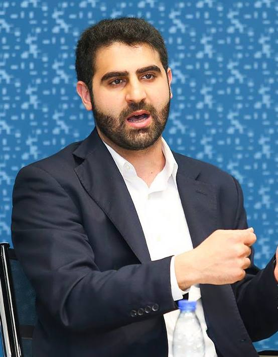

 

 

 

Welcome! I am a PhD candidate in political science at Stanford University, a graduate fellow at the [Immigration Policy Lab (IPL)](http://immigrationlab.org), and a PhD fellow at the [Center on Philanthropy and Civil Society](https://pacscenter.stanford.edu/). My primary research is in comparative politics and international relations with a focus on authoritarian media, political violence, and migration and refugees. To study these topics, my research combines fieldwork, machine learning, and experimental methods.

Prior to arriving at Stanford University, I was a [Junior Fellow](https://carnegieendowment.org/about/jr-fellows) at the Carnegie Endowment for International Peace. I grew up in Amman, Jordan and graduated from Dartmouth College with a degree in Government.

My research has been supported by [Innovations for Poverty Action's Peace and Recovery Program](https://www.poverty-action.org/program-area/peace-and-recovery), [Abbasi Program in Islamic Studies](https://islamicstudies.stanford.edu/), [Institute for Research in the Social Sciences (IRiSS)](https://iriss.stanford.edu/), [The Europe Center](https://tec.fsi.stanford.edu/), [Immigration Policy Lab](Immigration Policy Lab), [Stanford Center for Clinical and Translational Education and Research](https://med.stanford.edu/spectrum/b3_funding.html), [Stanford Institute for Economic Policy Research (SIEPR)](https://siepr.stanford.edu/), [Stanford Center on International Conflict and Negotiation (SCICN)](https://law.stanford.edu/stanford-center-on-international-conflict-and-negotiation-scicn/), [Stanford Center on Philanthropy and Civil Society](https://pacscenter.stanford.edu/), and the [Diversity Dissertation Research Opportunity (DDRO)](https://vpge.stanford.edu/fellowships-funding/diversity-dissertation). 

